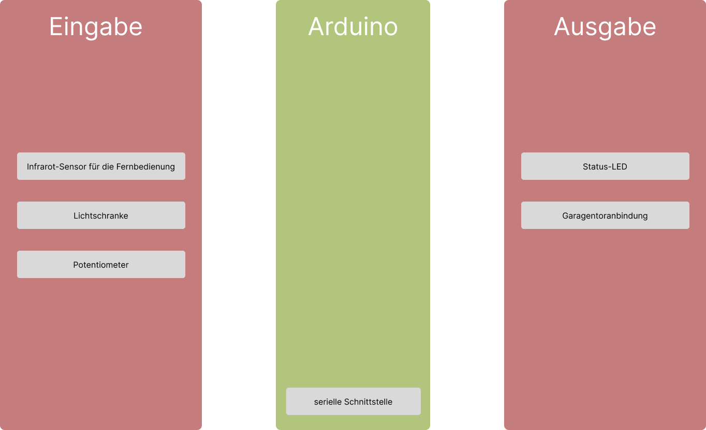

\tableofcontents

## 1 Einführung

Eine Schablone für die Arduinosoftwareentwicklung wurde gegeben. Dabei gibt es einige Verbesserungen, die bei dieser Schablone gemacht werden können. 
Eine wurde im dritten Dokument schon aufgeführt durch die Nutzung von User Stories im Requirements Engineering. Dazu können die Entwurfsprozesse der Hardware und die
Softwareentwicklungsprozesse durch agile Methoden effizienter gestaltet werden. 

# 2 Neue Schablone für Arduinosoftwareentwicklungsprojekte

Unsere neu entwickelte Projektschablone sieht wie folgt aus:

1. Einführung - Projektstart
    + Projektname
    + Projektbeschreibung
    + Stakeholder Definition
2. Requirements Engineering durch User Stories
3. Hardwarekomponenten
    + Definition eines minimalen Hardwareprototypen
    + Ausarbeiten der Hardware User Stories durch agile Methoden
4. Softwareentwicklung
    + Ausarbeiten der Software User Stories durch agile Methoden durch Testentwicklung
    + Softwareentwicklung gegen definierte Tests

# 3 Anwendung der neuen Schablone auf das gegebene Garagentor

Im alten Dokument wurde das Beispielprojekt eines Garagentors an die Schablone angewandt. Dies machen wir nun auch mit der
neuen Schablone.

## 3.1 Einührung - Projektstart

### 3.1.1 Projektname

Der Projektname lautet **Automatische Garagentorsteuerung**

### 3.1.2 Projektbeschreibung

Dieses Projekt realisiert eine automatisierte Garagentorsteuerung, welche sowohl für Nutzer und Techniker intuitiv ansteuerbar ist.

### 3.1.3 Stakeholder Definition

Dieses Projekt hat folgende Stakeholder:
 - Hausbesitzer, welche wir als Endnutzer definieren
 - Softwareentwickler
 - Hardwaredesigner und Hardwareentwickler, welche wir als Hardwareentwickler absegnen
 - Produktleiter, welche für die Planung und umsetzung des Projekt zuständig ist
 - Anbieter und Verkäufer der Komponenten, welche wir als Lieferanten bezeichnen
 - Verkäufer, welche das Produkt vertreiben, welche wir als Vertrieb definieren

## 3.2 Requirements Engineering durch User Stories

Bei den User-Stories können wir diese kategorisieren nach Stakeholder und dementsprechend auch diese in der Entwicklung gemäß der Wichtigkeit des Stakeholders priorisieren.
Betrachten wir zunächst die **Endnutzer User-Stories**:

- Ich als Endnutzer möchte, dass das Garagentor bequem ansteuerbar ist, sodass ich mich auf das sichere Ausfahren konzentrieren kann.
- Ich als Endnutzer möchte, dass es eine Statusanzeige für das Garagentor gibt, sodass Fehler oder sonstige Nachrichten einfach für mich zu erkennen sind um auf diese zu reagieren.
- Ich als Endnutzer möchte, dass das Garagentor stoppt, wenn ein Hindernis erkannt wird, sodass Personen oder Tiere nicht verletzt werden und auch schwerwiegende Schäden damit vorgebeugt werden.
- Ich als Endnutzer möchte, dass die Geschwindigkeit des Garagentors von mir angepasst werden kann, sodass alle Fahrzeugtypen genug Ein- und Ausfahrzeiten haben.
- Ich als Endnutzer möchte, dass es eine Möglichkeit gibt das Garagentor an meine Hausautomatisierung anzubinden, sodass mein Tagesablauf weiter vereinfach werden kann.

- Ich als Entwickler möchte, dass der Code modular und leicht erweiterbar ist, sodass neue Features und Updates einfacher eingebaut werden können.
- Ich als Entwickler möchte, dass bewährte Programmierstandards verwendet werden, sodass die Zusammenarbeit in Entwicklerteams wesentlich vereinfacht wird.

- Ich als Produktleiter möchte, dass das Projet innerhalb von 4 Wochen abgeschlossen wird, sodass wir es so schnell wie möglich Umsatz machen und somit Investoren bzw. den Vorstand zufrieden stellen können.
- Ich als Produktleiter möchte, dass möglichst kostengünstige Komponenten verwendet werden, sodass die Produktion in Masse nicht dem Unternehmenshaushalt schadet.

Diese User-Stories sind aus unterschiedlichen Stakeholder Perspektiven. Hierbei erkennt man, dass die konkrete Umsetzung noch nicht aufgeführt wird, um sich nicht in der Entiwicklung zu stark einzuschränken und auch entsprechend passende
Komponenten für die User-Stories zu verwenden.

## 3.3 Hardwarekomponenten

### 3.3.1 Definition eines minimalen Hardwareprototypen

Übertragen wir die Endnutzer User-Stories in die Tabelle, da diese die Hauptspezifaktionen des Garagentors enthalten. Dabei vergeben wir den einzelnen User-Stories eine Identifkationsnummer und fügen eine Spalte hinzu, wo mögliche Hardwareumsetzungen genannt werden.

| Story-ID | User-Story | Mögliche Hardwareumsetzung |
|----------|------------|----------------------------|
|1| Ich als Endnutzer möchte, dass das Garagentor bequem ansteuerbar ist, sodass ich mich auf das sichere Ausfahren konzentrieren kann. | - Verwenden einer Fernbedienung, welche einen Knopf zum Ansteuern des Garagentors hat |
|2| Ich als Endnutzer möchte, dass es eine Statusanzeige für das Garagentor gibt, sodass Fehler oder sonstige Nachrichten einfach für mich zu erkennen sind um auf diese zu reagieren. | Farb-LED, welches je nach Farbe einen unterschiedlichen Status repräsentiert; 7-Segment Display, welches einen Fehlercode anzeigt, welches einen Zustand repräsentiert; LCD-Display, welches eine verständliche Statusnachricht ausgibt.|
|3| Ich als Endnutzer möchte, dass das Garagentor stoppt, wenn ein Hindernis erkannt wird, sodass Personen oder Tiere nicht verletzt werden und auch schwerwiegende Schäden damit vorgebeugt werden. | Nutzen einer Lichtschranke, welche bei einem Hindernis ein Signal an den Arduino sendet zum Stoppen des Garagentors |
|4| Ich als Endnutzer möchte, dass die Geschwindigkeit des Garagentors von mir angepasst werden kann, sodass alle Fahrzeugtypen genug Ein- und Ausfahrzeiten haben. | Nutzen eines Potentiometers, um die Geschwindigkeit des Garagentors anzupassen; Änderung eines festgesetzten Geschwindigkeitswerts über eine grafische Benutzeroberfläche oder eine serielle Wartungsschnittstelle | 
|5| Ich als Endnutzer möchte, dass es eine Möglichkeit gibt das Garagentor an meine Hausautomatisierung anzubinden, sodass mein Tagesablauf weiter vereinfach werden kann.| Anbindung über die serielle Wartungsschnittstelle; Einbau eines Smart-Home Protokolls in der Garagentorsoftware |

Neben den genannten Methoden, sind auch weitere Umsetzungen möglich, welche man in einer Forschungsphase ausarbeiten kann und durch einen minimalen Prototypen dem Kunden vorstellen kann. Die Option, welche den Kunden am meisten anspricht, nimmt man für das weitere Vorgehen.

### 3.3.2 Ausarbeiten der Hardware User Stories durch agile Methoden

Definieren wir solch einen minimalen Hardwareprototypen anhand der gegebenen möglichen Hardwareumsetzungen.

Diesen Prototypen können wir dem Kunden vorstellen und auf dieser Basis die gewünschten Funktionalitäten einbauen beziehungsweise Änderungen leicht und flexibel vornehmen (bspw. die Verwendung eines LCD Displays statt einer Status LED bei der Statusausgabe).
Die oben aufgeführten User-Stories können durch agile Ansätze wie Scrum oder Kanban durchgeführt werden:

#### 3.2.2.1 Umsetzung durch Scrum

In Scrum können die User-Stories zunächst in ein Product Backlog hinterlegt werden und dann in ein sogenanntes Inkrement eines Sprints (Arbeitseinheit) eingebracht werden.
Dies bezeichnet eine Menge an Zielen, welche man innerhalb eines gegebenen Zeitraums zu erfüllen hat. 
Am Ende des Zeitraums werden dann implementierte Features ausgeliefert. Kommt es hierbei zu Komplikationen (bspw. dass bestimmte User-Stories im gegebenen Zeitrahmen nicht abgeschlossen werden konnten), so wird das weitere Vorgehen bei einer Sprint Retrospektive 
bestimmt.

![Eine kompakte Übersicht des Scrum Frameworks [1]](../images/scrum-schaubild.png)

In unserem Beispiel können wir die Tabelle in 3.3.1 als Product Backlog nehmen und daraus folgende Inkremente bauen, welche in dafür vorgesehene Sprints implementiert werden:

##### Inkrement 1: Einbau des Infrarot-Sensors und Anbindung an das Garagentor
Ziel: Man kann durch die Fernbedienung das Garagentor Ansteuern

##### Inkrement 2: Einbau der Lichtschranke und der Status-LED
Ziel: Das Garagentor kann Hindernisse erkennen, anhalten und den Vorfall über die Status-LED erkennbar machen.

##### Inkrement 3: Einbau des Geschwindigkeitspotentiometers
Ziel: Anhand eines Potentiometers, kann die Geschwindigkeit des Garagentors angepasst werden.

##### Inkrement 4: implementierung eines Smart-Home Protokolls
Ziel: Smart Home Anwendungen, können das Garagentor über die serielle Schnittstelle ansteuern.

#### 3.2.2.2 Umsetung durch Kanban

Bei Kanban arbeitet man mit sogenannten Kanban-Boards. Auf diesem Board werden die User-Stories in Spalten gelegt. Dabei repräsentieren die Spalten unterschiedliche Arbeitsstände (bspw. *To-Do*, *In Arbeit* und *Abgeschlossen*).
Hier ist ein Beispiel für solch ein Kanban-Board:

![Beispiel eines Kanban-Boards [2]](../images/kanban-beispiel.webp)

Hierbei können die einzelnen Features, welche wir in 3.2.2.1 genannt haben, in eigene Arbeitspakete fassen, welche durch das Kanban-Board durchgereicht werden.

Bei der Hardwareentwicklung können dabei auf Tools wie TinkerCAD oder Wokwi zurückgegriffen werden und zur Organisation des Projekts können Softwaretools wie Atlassian Jira oder für Kanban GitHub Projects verwendet werden.

## 3.4 Softwareentwicklung

### 3.4.1 Ausarbeiten der Software User Stories durch agile Methoden und Schreiben von Tests

In unserem Fall, können wir durch die in 3.2 genannten User Stories folgende Testfälle aufstellen:

1. Empfängt der Infrarotsensor ein simuliertes Fernbedienungssignal, so reagiere darauf.
2. Wird die Lichtschranke blockiert, so sende ein Signal.
3. Reagiere auf Geschwindigkeitsänderungen.
4. Binde an eine simulierte Smart Home Umgebung an.

### 3.4.2 Softwareentwicklung gegen definierte Tests

Diese Tests können mit Frameworks wie Google Test und auch TinkerCAD/Wokwi durchgeführt werden. Dabei verwendet man Google Test für Unit und Integrationstests, während man TinkerCAD für End-to-End Tests verwendet.
Für die Entiwicklung mit Google Test und Wokwi, kann auf die Projektstruktur von Dokuemnt 1 zurückgegriffen werden.

# Quellen

[1] https://www.it-agile.de/fileadmin/bilder/wissen/Bierdeckel_20_Vor.png (Abrufzeitpunkt: 30.05.2025, 12.15 Uhr)
[2] https://www.salesgoesdigital.com/wp-content/uploads/2023/08/Beispiel-eines-Kanban-Boards-mit-vier-Spalten-980x551.png (Abrufzeitpunkt: 30.05.2025, 12:42 Uhr)