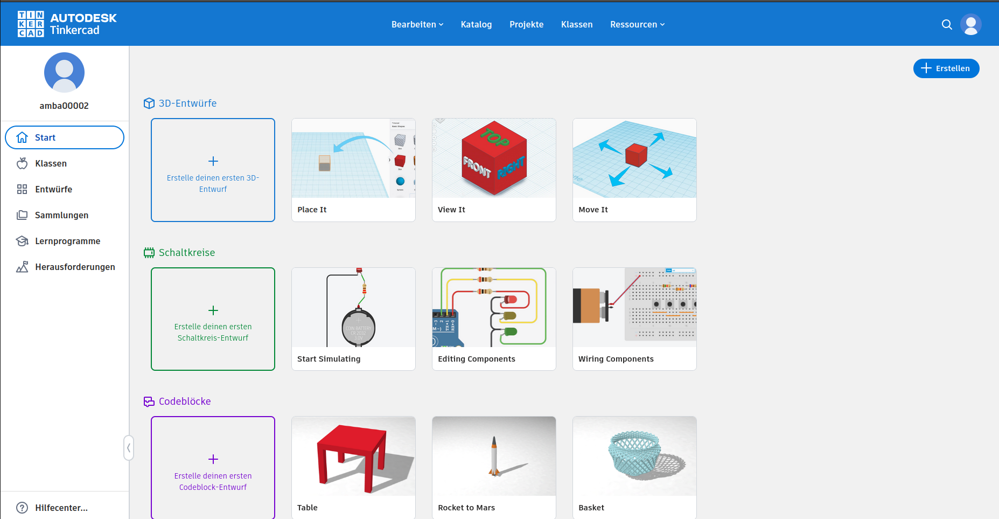
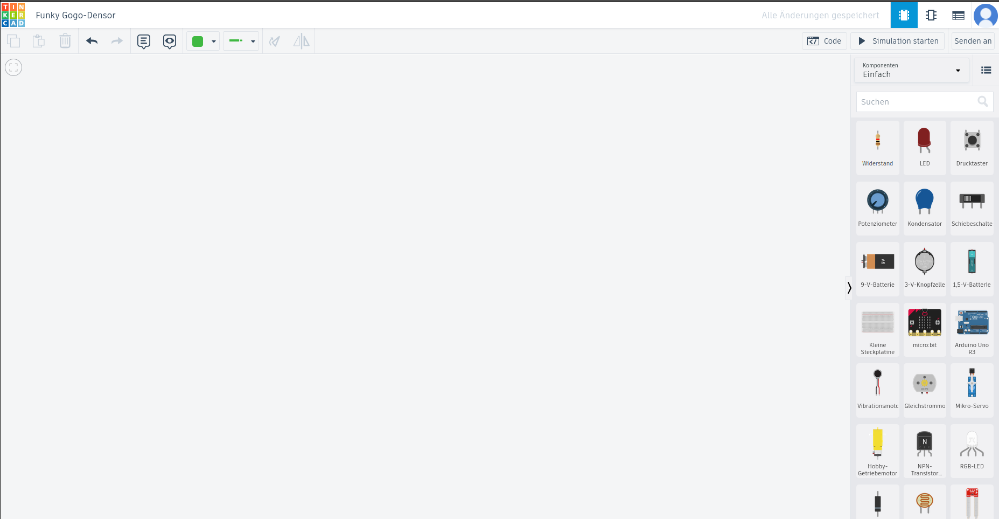
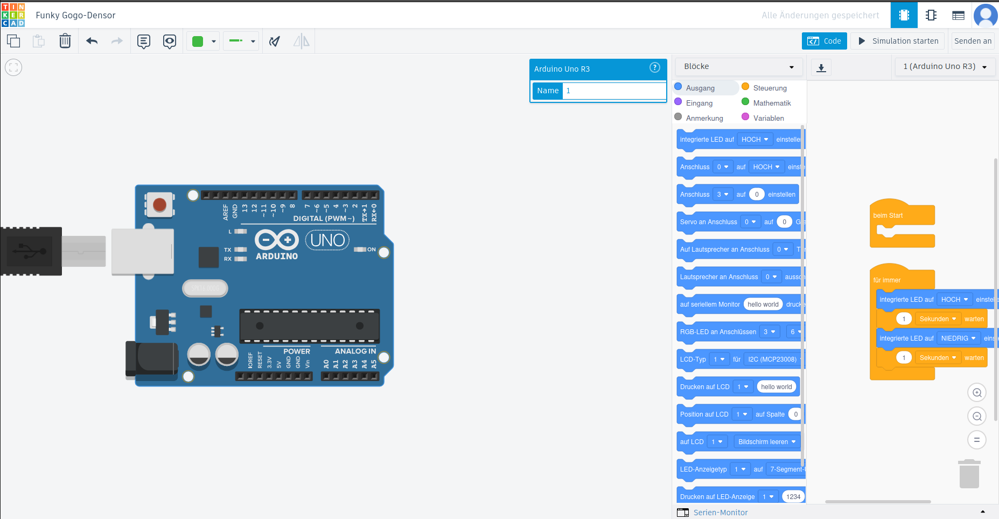
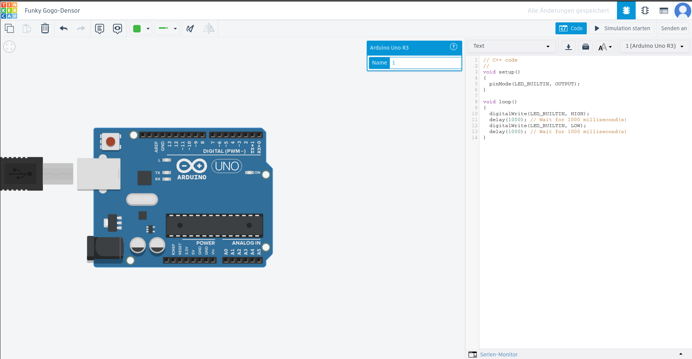
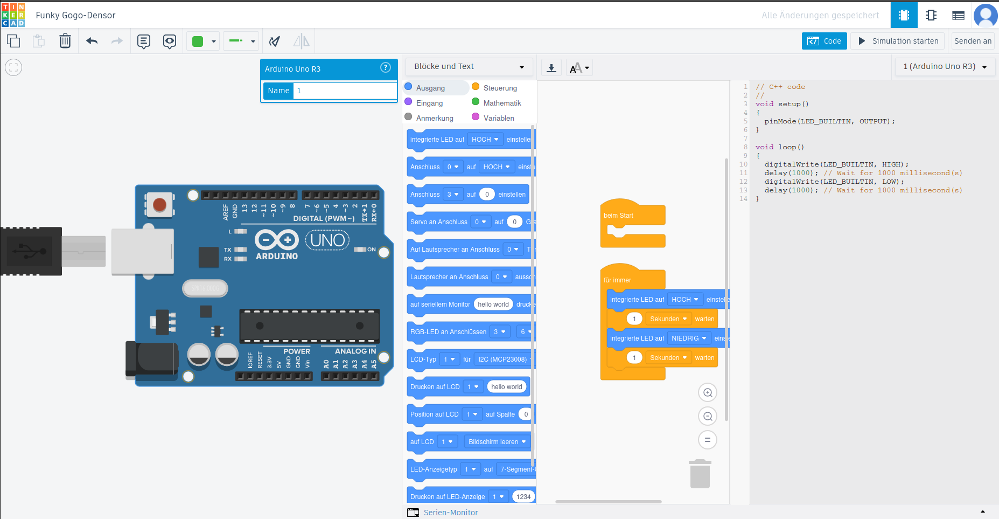

\tableofcontents

## 1 Einführung

In Dokument 1 und Dokument 2 haben wir die Entwicklungsumgebung und den Build-Prozess bei der Arduino-Softwareentwicklung beleuchtet. Dabei gab es auch die Möglichkeit komplett platinenfrei zu arbeiten 
durch Simulationsplattformen wie Wokwi kombiniert mit der Arduino-CLI und dem Texteditor VSCode. In Dokument 3 haben wir dann das Requirements-Engineering für Arduino Softwareprojekte beleuchtet und mit User-Stories
erweitert. In der alten Schablone, welche in Dokument 3 angesprochen wurde, wird auch der Aspekt der Anforderungsvalidierung angesprochen. Meist ist es so, dass solche Tests auf physischer Hardware durchgeführt werden. Jedoch ist hier die Einrichtung und 
Durchführung sehr zeit- und kostspielig, da hierfür benötigtes Personal und Material (Board und Komponenten) angeschafft werden müssen. Darüber hinaus verlangsamt solch ein Vorgehen, den Entwicklungsprozess sehr. Eine Möglichkeit dem entgegenzuwirken und auch einen schnelleren und effektiveren
Entwicklungsprozess zu haben, ist eine Testgetriebene Entwicklung mit der Verwendung einer simulierten Arduinoumgebung. In dem Fall sind alle Komponenten virtuell, sodass keine physische Einrichtung notwendig ist. Die Einrichtung von virtuellen Umgebung kann einmalig durchgeführt werden und kann danach abgespeichert werden,
sodass eine Testsituation mehrmals ohne erheblichen Mehraufwand aufgestellt werden kann. 
Eine Simulationsplattform, welche wir schon beleuchtet haben ist Wokwi. Jedoch hat diese den Nachteil, dass diese auf einem kostenpflichtigen Lizenzmodell basiert. Deswegen betrachten wir in diesem Dokument die Simulationsumgebung TinkerCAD. Diese bietet auch wie Wokwi die Möglichkeit einen simulierten Arduino zu verwenden und auch für diesen
Code zu schreiben.

## 2 TinkerCAD Simulationsplattform

TinkerCAD ist eine webbasierte Plattform, welche neben 3D Modellierung auch die Möglichkeit bietet, Schaltkreise zu modellieren und diese auch zu simulieren. Im Gegensatz zu Wokwi ist diese Plattform kostenlos und benötigt nur ein Benutzerkonto, welches man kostenlos anlegen kann. Die Plattform ist erreichbar unter der Web-Addresse

https://www.tinkercad.com/circuits

Nach der erfolgreicher Anmeldung wird man auf die Benutzeroberfläche weitergeleitet:

Hier gibt es dann die Möglichkeit einen leeren Schaltkreisentwurf zu erstellen. Tut man dies so erhält man folgende Ansicht:

TinkerCAD bietet hier neben zahlreichen virtuellen Komponenten auch eine virtuelle Arduino-Uno Platine, welche auch programmierbar ist durch einen internen Code-Editor. Dabei gibt es zwei Möglichkeiten die Platine zu programmieren: 
Zum einen durch sogenannte Blöcke, welche es ermöglichen grafische Blöcke, die Codeinstruktionen repräsentieren, zusammenzusetzen. Dabei wird der Code für die Platine im Hintergrund erzeugt und auf die virtuelle Platine geladen. Eine andere Möglichkeit ist 
durch eigentlichen C++ Code in einem integrierten Code Editor auf der Weboberfläche.

Die vorhin genannte Überführung von Code-Blöcken zum Platinen-Code ist auch ersichtlich durch den Modus *Blöcke und Text*, welche die Code-Blöcke und den dadurch erzeugten Code nebeneinander anzeigt.

Durch einen Klick auf die Taste *Simulation starten* kann man dann den geschriebenen Code auf der virtuellen Arduino-Platine ausführen.