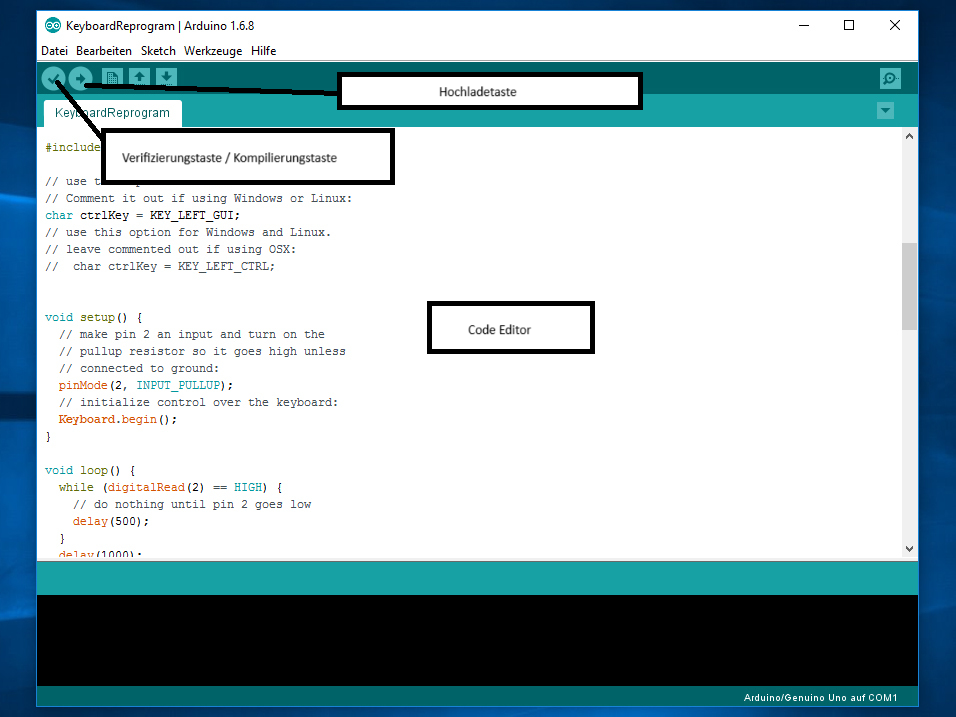

# Projektarbeit: Software Entwicklung für Arduino

## Phase 1 Entwicklungsumgebung und Build Prozess

Das Arduino ist ein Board, welches es ermöglicht selbstgeschriebenen Code, welcher für das Board ausgelegt ist auf dessen Hardware auszuführen und damit Probleme zu lösen. Dabei gibt es unterschiedliche Arten und Weisen, wie man für einen Arduino entwickelt, welche in diesem Dokument beleuchtet und erläutert werden.

### 0. Genereller Entwicklungsprozess

Bevor wir die unterschiedlichen Arten beleuchten, wie man Code für einen Arduino schreibt, betrachten wir zunächst den generellen Entwicklungsprozess für einen Arduino:

1) Man schreibt den Code in einer .ino Datei. Dabei ist die Syntax des Codes sehr nah an C/C++.

2) Diese .ino Datei wird dann von einem Compiler kompiliert (man spricht im Arduino Bereich auch von verifiziert) und es werden Artefakte wie eine Binärdatei im ELF Format und ein Bootloader erstellt, um das Board zu initialisieren, bevor der Code auf dem Board ausgeführt wird.

3) Die erzeugten Artefakte werden auf das Board hochgeladen und das Board startet sich neu und der hochgeladene Code wird ausgeführt.

Nachdem wir nun also den generellen Entwicklungsprozess beleuchtet haben, betrachten wir nun die unterschiedlichen Arten und Weisen, um für den Arduino zu programmieren.

### 1. Das Verwenden der Arduino IDE

Der Hersteller Arduino, bietet selbst eine integrierte Entwicklungsumgebung (kurz: IDE) an, um Code für das Arduino Board zu schreiben, zu kompilieren und auch auf das Board hochzuladen. Dies geschieht alles auf einer grafischen Benutzeroberfläche, welche wie folgt aufgebaut ist.

(Quelle: https://www.chip.de/ii/4/2/9/4/3/5/5/2/e32aa9a3718b3afd.jpg; Abrufzeitpunkt: 22.04.2025; 09:50 Uhr)

#### Installation

Um die IDE zu installieren, lädt man sich die entsprechende Installationsdatei (bzw. bei Linux die entsprechende Binary oder das AppImage) von der Webseite des Herstellers Arduino herunter und führt die Installation aus.

#### Entwicklungsprozess

Der Prozess des Entwickelns in der IDE ist wie folgt:

1) Der Code wird im Code-Editor geschrieben.
2) Durch Anklicken der Verfikationstaste, wird der geschriebe Code verifiziert und kompiliert.
3) Das Arduino Board, auf welches der Code hochgeladen wird, wird angeschlossen via USB.
3) Mit einem Klick auf die Hochladetaste, werden die kompilierten Artefakte auf das angeschlossene Board hochgeladen und schon nach wenigen Sekunden ausgeführt.

Diese Art des Entwickelns, ist sehr intuitiv und einsteigerfreundlich, da die grafische Benutzeroberfläche sehr minimal gehalten und übersichtich gehalten ist und die nötigsten Funktionen griffbereit plaziert sind.

**Hinweis:** Es gibt bei neueren Versionen der Arduino IDE auch die Möglichkeit den hochgeladenen Code auf seinem Board zu debuggen. Dies erleichert die Fehlersuche bei Bugs sehr stark. Dabei gilt aber zu beachten, dass diese Funktion nicht für alle Boards verfügbar ist. In unserem Fall, ist die Debugging Funktion für den Arduino Uno nicht verfügbar.

### 2. Das Verwenden der Arduino CLI

Neben der Arduino IDE, bietet der Hersteller Arduino auch eine Kommandozeilenschnittstelle (oder auch Command Line Interface; kurz CLI), welche es ermöglicht Code für den Arduino zu kompilieren und hochzuladen.

#### Installation

Für die Installation wird die entsprechnde CLI Binary vom Arduino CLI GitHub Repository heruntergeladen und man hat das CLI direkt griffbereit ohne jegliche Installation (außer bei der .msi Version von Windows, wo eine Installation zunächst ausgeführt wird). 

Wie man die CLI in die Entwicklungsumgebung zu integrieren weiß, wird vorausgesetzt. 

Mit dem Befehl 
`arduino-cli help ` [1]

erhält man eine umfangreiche Liste an Befehlen, welche die CLI bietet und mit `arduino-cli <Kommando> --help`[2] erhält man nähere Details bezüglich eines CLI Befehls und den Flags, welche dieser Befehl mit sich bringt.

#### Initialisierung der CLI

Bevor man die CLI zur Kompilierung verwendet muss diese noch initialisiert werden mit Standardkonfigurationswerten für die CLI. Dies kann man machen mit dem Befehl:

`arduino-cli config init` [3]

Daraufhin sollte man den lokalen Zwischenspeicher für Bibliotheken und Boardplattformen aktualisieren mit dem Kommando

`arduino-cli core update-index` [4]

#### Entwicklungsprozess

Der Prozess des Entwickelns mit der CLI ist wie folgt:

1) Der Code wird mithilfe eines Text Editors wie Visual Studio Code, Vim, Nano, usw. geschrieben und in einer .ino Datei hinterlegt. Dabei muss sichergestellt sein, dass der Name der Code Datei, dem Namen des darinliegenden Verzeichnisses übereinstimmt.

2) Mit dem CLI Kommando:

    `arduino-cli  compile –-fqbn <Vollständig qualifizierter Platinenname (kurz FQBN)> <Dateiname>.ino`[5]

    wird der Code, für die angegebene Arduino Platine kompiliert. Man sollte hierbei beachten, dass die Plattform für diese Platine auch auf dem Rechner installiert ist. 

3) Die Arduino-Platine wird an den Rechner angeschlossen.
4) Mit dem CLI Kommando:

    `arduino-cli upload –p <Geräteport, an welchem sich das Board befindet> --fqbn <Vollständig qualifizierter Platinenname> <Dateiname>.ino` [6]
    
    werden die kompilierten Artefakte auf das Board hochgeladen und bei erfolgreichem Hochladen, wird nach wenigen Sekunden, der hochgeladene Code auf dem Board ausgeführt.

##### Ermitteln des Vollständig quanitifierten Platinennamens

Dabei kann der vollständig quantifizierte Platinenname der gewünschten Platine wie folgt ermittelt werden:

1) Die Platine wird an den Rechner angeschlossen.
2) Das CLI Kommando `arduino-cli board list` [7] wird ausgeführt, um eine Übersicht an angeschlossener Platinen zu erhalten. Diese Übersicht hat dabei folgende Struktur:

`<Geräteport> | <Verbindungstyp> | <Board Name> | <FQBN> | <Boardplattform>`

##### Platinenplattformen und deren Installation

Es sollte sichergestellt werden, dass die Boardplattform für welche man kompiliert, installiert ist. Dies kann man wie folgt tun:
1) Das CLI Kommando `arduino-cli core list` [8] wird ausgeführt.
2) Ist die gewünschte Boardplattform nicht angegeben, so kann man diese mit folgendem CLI Kommando installieren: `arduino-cli core install <Boardplattform>` [9]
    
     Darüber hinaus ist es auch möglich Boardplattformen von Drittanbietern zu installieren, darauf wird hier aber nicht weiter eingegangen

##### Kompilierungsartefakte

Will man die Artefakte der Kompilierung erhalten, so ist dies möglich durch setzen des –e Flags:

`arduino-cli  compile –-fqbn <Vollständig qualifizierter Platinenname (kurz FQBN)> -e <Dateiname>.ino` [10]

Dies liefert uns einen Ordner build mit folgender Struktur:

    build
        <FQBN des Board, jedoch mit . Anstatt : als Trennzeichen>
            Build Artefakte (Binary, Bootloader, etc)  

### 3. Boardlose Programmierung durch die Arduino-CLI und der Wokwi Simulationsumgebung mit Visual Studio Code

Nun gibt es auch mal den Fall, dass man zwar Code für einen Arduino schreiben möchte, diesen aber nicht bereit hat. Darüber hinaus ist das Testen von Code durch ständiges Anschließen und Hochladen sehr ineffizient. Um diese Hürde zu umgehen, gibt es die Möglichkeit, geschriebenen Arduino-Code auf einem simulierten Arduino zunächst laufen zu lassen. Dies ermöglicht schnelleres Feedback bei der Entiwicklung und somit auch einen rapideren Entwicklungsprozess. 

Als Simulationsumgebung kann man die Simulationsumgebung Wokwi nutzen. Diese bietet neben ihrer Web Simulation auch die Möglichkeit ihre Simulation auf dem Text Editor Visual Studio Code ausführen zu lassen durch eine von ihnen gegebene Erweiterung. 

#### Entwicklungsablauf

Der Entwicklungsablauf sieht wie folgt aus:
1) Der Arduino Code wird in VSCode geschrieben.
2) Der Code wird mit der Arduino CLI kompiliert.
3) Lasse den Code auf der Simulation ausführen durch Einbinden der ausgegebenen Artefakte in die Wokwi Umgebung.

#### Installation
Es wird vorausgesetzt, dass die Arduino CLI installiert wurde.

1) Herunterladen und Installieren der IDE Visual Studio Code, welche kostenlos von Microsoft auf deren angeboten wird.

2) Installieren der Wokwi Extension auf Visual Studio Code durch Suche nach der Wokwi Extension im Visual Studio Code Marketplace und dem Anklicken der Installationstaste.

#### Einrichtung

Um die Wokwi Extension zu nutzen benötigt man eine Lizenz. Wokwi bietet eine kostenlose Lizenz für persönliche Zwecke. Dabei gilt zu beachten, dass diese nur für 30 Tage gültig ist.

Um ein Projekt mit der Arduino CLI und der Wokwi Extension aufzustezen muss eine andere Projektstruktur verwendet werden. Um hier Einrichtungshürden zu umgehen, wird ein <a href="">Bash Skript</a> zur Verfügung gestellt. 

Dieses Skript baut eine Projektumgebung auf und das Kompilieren und einbinden der Artefakte in die Wokwi Umgebung wird möglich gemacht durch das Kommando 

`make compile`

Dabei wird vorausgesetzt, dass das Programm Make installiert ist.

Geht man nun in die Simulationsumgebung und startet diese, wird der geschriebene Code in der Simulationsumgebung ausgeführt.

Neben der Möglichkeit Wokwi in VSCode zu nutzen, gibt es auch die Möglichkeit Wokwi in CI/CD Tools wie GitHub Actions zu verwenden, sodass man Code schneller testen kann und somit einen schnelleren Entwicklungsprozess hat.

### 4. Quellen
[1,2]: Hilfesektion der Arduino CLI (aufrufbar mit `arduino-cli help`)  
[3,4,5,6,7,8,9,10]: https://docs.arduino.cc/arduino-cli/getting-started/?_gl=1*dnm5ej*_up*MQ..*_ga*MTIyNDY1NjI0OC4xNzQ0NzAxMjQ2*_ga_NEXN8H46L5*MTc0NDcwMTI0NC4xLjAuMTc0NDcwMTI0NC4wLjAuMTY0MTQ4MDg5Mw ; Abrufzeitpunkt: 14.04.2025, 13:27Uhr
