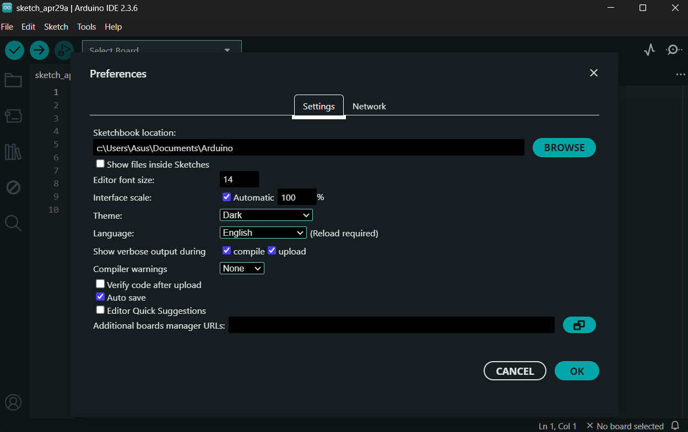
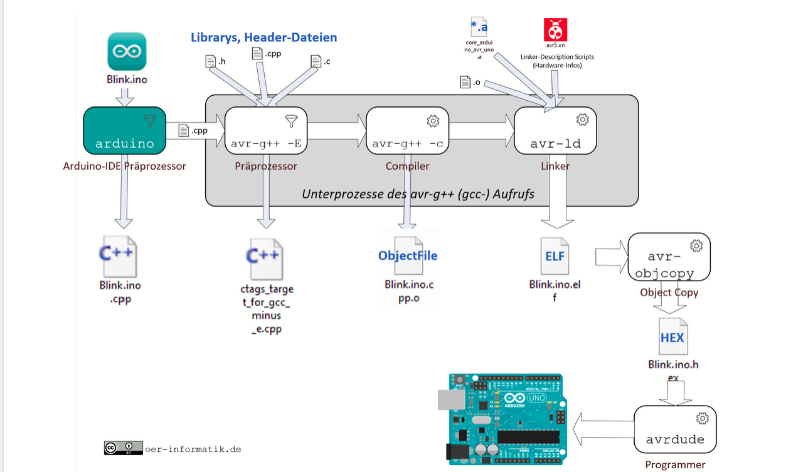

\tableofcontents

## 1 Einführung

Die Arduino-Entwicklungsumgebung(IDE) bietet eine einfache Möglichkeit, Mikrocontroller zu programmieren, indem sie eine benutzerfreundliche Oberfläche und vordefinierte Bibliotheken zur Verfügung stellt.
Damit ein Programm jedoch auf einem Arduino-Board ausgeführt werden kann, muss es zunächst in Maschinensprache übersetzt und übertragen werden. Dieser Prozess wird als "Buildprozess" bezeichnet. 

In dieser Dokumentation wird dieser Prozess Schritt für Schritt erklärt: vom Schreiben des Codes über dessen Kompilierung bis hin zur Übertragung auf das Arduino Board. 
Ziel ist es, ein grundlegendes Verständnis zu ermitteln, was im Hintergrund der IDE passiert und wie aus dem geschriebenen Code ein voll funktionsfähiges Programm für das Arduino-Board entsteht.

Zwar ist die hier angegebene Einrichtung speziell auf die Arduino-IDE beschrieben, jedoch ist der Build-Prozess der Arduino-IDE und auch der Arduino-CLI gleich.

## 2 Korrekte Einrichtung der Arduino-IDE
Die Arduino-IDE versucht möglichst viel Komplexität im Hintergrund des Build-Prozesses zu verstecken. Um die konkreten Ausgaben des Kompilier- und Hochladeprozesses zu sehen, müssen wir vor der Kompilierung 
eine kleine Änderung in den Einstellugen der IDE machen. Dazu gehen wir in ```files/preferences``` und wählen unter der Option **Show verbose output during:** ***compile*** und ***upload***.



Analog ist es auch möglich in der Arduino-CLI diese erweiterten Ausgaben zu bekommen durch folgende Kommandos:

Beim Kompilieren:

```arduino-cli compile -v --fqbn <Vollständig quantifizierter Platinenname> <Sketchname>``` [4]

Beim Hochladen:

```arduino-cli upload -p <Geräteport, an welchem das Board angeschlossen ist> --fqbn <Vollständig qualifizierter Platinenname> <Sketchname>``` [5]

## 3 Grafische Darstellung des Buildprozesses und Schritt für Schritt Erklärung

 [1]

### 3.1 Vorverarbeitung durch Arduino-IDE
Zur Kompilierung des Codes benutzt die Arduino-IDE eine spezielle Version des  \textbf{GCC\footnote{GCC ist ein Toolchain, das für die Übersetzung des Codes in Assembly Sprache und für die Vorbereitung der ausführbaren Dateien zuständig ist.} Compilers}, welche an die Chiparchitektur des Arduino Boards angepasst ist. Wenn der Compiler aufgerufen wird, werden die folgenden Schriite ausgeführt: 

- Präprozessor
- Kompilierung  
- Linking


Die (*.ino) Datei wird durch den Compiler in eine C++ Datei kompiliert. Die notwendigen Bibliotheken, insbesondere **Arduino.h**, werden automatisch eingebunden. 

### 3.2 Präprozessor-Schritte mit GCC
Bevor der Arduino-Sketch in Maschinencode übersetzt wird, wird er von einem C++ Präprozessor bearbeitet. Dieser ist ein Teil vom Compiler und führt Textverarbeitungen und Entfernungen durch. Das heißt, dass Header-Dateien und 
Libraries reinkopiert und bedingte Ersetzungen durch ```#ifdef``` oder  ```#ifndef``` ausgewertet werden. Die Kommentare werden auch in diesem Schritt entfernt und man bekommt am Ende eine lange, vollständige .cpp-Datei. 

### 3.3 Kompilierung
Dieser Prozess besteht insgesamt aus zwei Schritten.

Die **Kompilierung** wandelt die erweiterte C++ Datei in Assembler-Code um. Das ist maschinennaher Code für den Prozessor, aber nicht der endgültige Code.

Der zweite Schritt ist die **Assemblierung**. In diesem Schritt wird die Assembler Datei( *.s) in eine Objektdatei(*.o) umgewandelt.

Erst bei der Kompilierung wird der Code auf Syntaxfehler geprüft und wir erhalten entsprechende Fehlermeldungen. Um den Inhalt von der Objektdatei zu sehen, können wir das Kommando ```avr-objdump.exe -t *.o``` nutzen.

***Hier ist es zu beachten, dass die Objektdatei an sich nicht ausgeführt werden kann und mit anderen Dateien und Bibliotheken zu einer Elf-Binärdatei gelinked werden muss.***

### 3.4 Linking
In diesem Schritt werden alle Objektdateien und Bibliotheken mit der Hardware, auf welcher der Code später laufen soll, verknüpft. Das heißt, dass der Linker Informationen bezüglich der Hardware benötigt.   

Der Linker fügt alle notwendige Abhängigkeiten hinzu und macht aus den ganzen Dateien eine **Executable and Linking Format(*.elf)** Datei im Binärformat.

### 3.5 Erzeugung der HEX-Datei
Der Hochladeprozess sieht vor, dass der komplierte Maschinencode im Hexadezimalformat vorliegt, um diesen im Speicher zu hinterlegen. 
Durch das Tool ```avr-objcopy``` wird dies möglich gemacht,

### 3.6 Übertragung des Codes auf dem Board
Der letzte Schritt ist die Übertragung von unserem Code auf den Mikrocontroller. 
Dies wird durch den **Programmer**\footnote{Ein Gerät oder Programm, die den .hex Code in den Speicher des Mikrocontrollers überträgt.}} 
(in diesem Fall **avrdude**) gemacht.

## 4 Zusammenfassung
In diesem Dokument wurde der vollständige Buildprozess eines Arduino-IDE erläutert. Die Kenntnis über dieser Prozess hilft uns, Fehler besser einzuordnen, gezielter zu debuggen und schnell Probleme zu erkennen. 


## 5 Quellen
1) https://oer-informatik.de/arduino_compile_prozess
2) https://ccrma.stanford.edu/planetccrma/man/man1/avr-g++.1.html
3) https://www.incredibuild.com/integrations/gcc
4) Hilfesektion der Arduino CLI bezüglich des `compile`Kommandos (aufrufbar durch `arduino-cli compile --help`)
5) Hilfesektion der Arduino CLI bezüglich des `upload`Kommandos (aufrufbar durch `arduino-cli upload --help`)